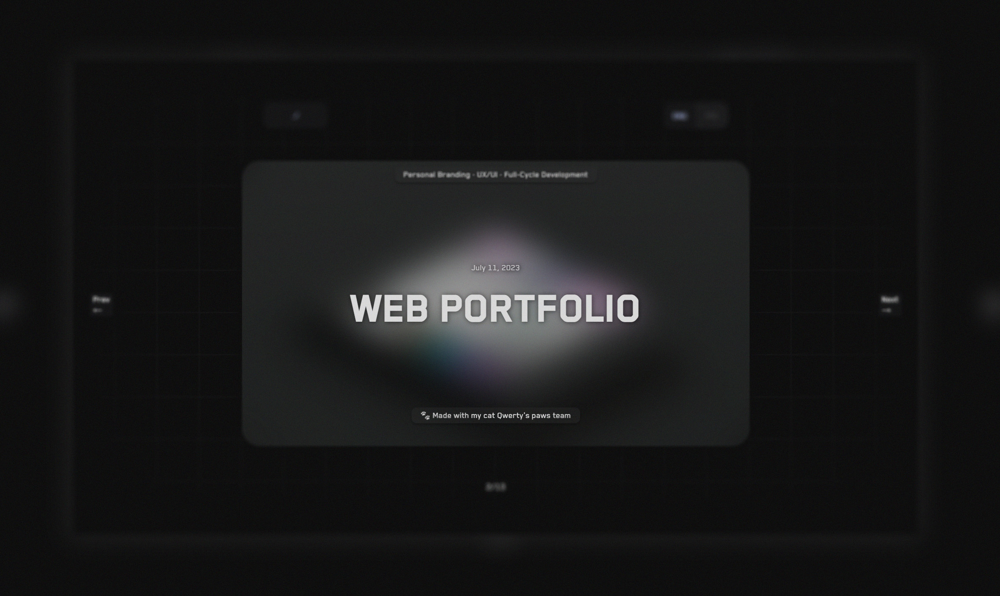

# Here, I store my works

   

## Overview

This portfolio is a curated display of my projects, providing a glimpse into my design and development capabilities. Set against a dark theme highlighted by neon accents, each element has been handcrafted to ensure quality and precision. One distinct feature is the horizontal scrolling, allowing each project to stand out and capture the viewer's attention.

## Stack

- JavaScript
- Next
- React
- GitHub Actions
- SASS
- Remark
- Rehype
- Stylefire
- Popmotion
- ESlint

## Viewing

[echo-vladimir.github.io/portfolio](https://echo-vladimir.github.io/portfolio/)

## Contact

echo.vladimir.k@gmail.com.
