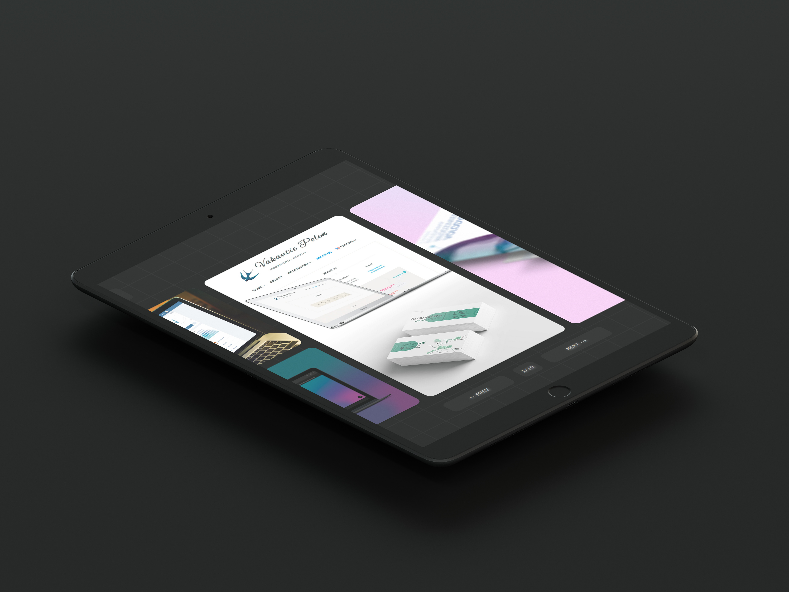

# ./

## Overview

This portfolio is a curated display of my projects, providing a glimpse into my design and development capabilities. Set against a dark theme highlighted by neon accents, each element has been handcrafted to ensure quality and precision. One distinct feature is the horizontal scrolling, allowing each project to stand out and capture the viewer's attention.

## Stack

- Next
- React
- SASS
- Remark
- Rehype
- Stylefire
- Popmotion
- ESlint

## Viewing

[echo-vladimir.github.io/portfolio](https://echo-vladimir.github.io/portfolio/)

## Contact

If you have feedback or suggestions, feel free to reach out at
echo.vladimir.k@gmail.com.

## Note

This project showcases my work and is for viewing only. Redistribution, copying,
or any other use without my direct permission is not allowed. Please respect
this. For details, see [LICENSE](./LICENSE.md).
